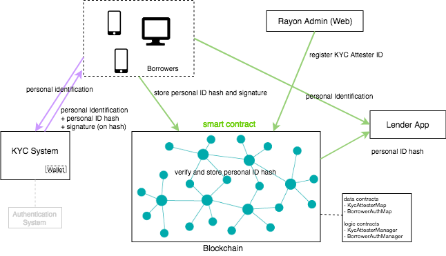

# RayonProtocol KYC System Prototype

This is a prototype of RayonProtocol's KYC System.

## About
### Architecture
 - The KYC System server make a signature on given identity data
 - KYC Management smart contract verify and register KYC attestation data on blockchain.



## Getting Started

### Installing

- clone the repository to your local drive

```
git clone https://github.com/rayonprotocol/rayonprotocol-kycsystem-prototype.git
```

- install truffle

```
npm install -g truffle
```

- install ganache for use of local development node

http://truffleframework.com/ganache/

- install yarn (for mac)

https://yarnpkg.com/lang/en/docs/install/#mac-stable

- install node_module

```
cd rayonprotocol-kycsystem-prototype
yarn
```

#### Deployment

- deploy smart contracts

```
truffle deploy

```

#### Execution

- start kyc system server

```
cd nodejs
node kyc_server.js <keystore file>

KYC Attester's keystore filepath: <keystore file>, exists: true

Keystore password: *********

Loading keystore file success.
KYC Attester ID: 0x1a5232919693b2f3d5ec2a5e44ae925c1edd4c95

KYC Prototype server is running on port 8001!

```
- kyc system server is running on port 8001

#### Test

- execute test scripts

```
truffle test

```

* [Truffle](https://truffleframework.com/) - Ethereum Smart Contract Framework
* [Solidity](https://github.com/ethereum/solidity) - Used to develop the Reverse Inquiry smart contracts
* [Node.js](https://nodejs.org/en/) - Server application framework for KYC System

## Acknowledgments
* The real KYC System should connect to external identity verification system before making a signature.

